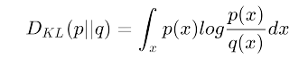
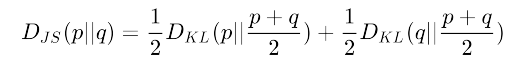

# What is GAN(Generative Adversarial Network)?
> A deep neural network architecture made up of two networks, a generator network and a discriminator network.

Through multiple cycles of generation and discrimination, both networks train each other, while simultaneously 
trying to outwit each other.

# What is a generator network?
A generator network uses existing data to generate new data. Ex: Use existing image to generate new images.
The generator's primary goal is to generate data (such as images, video, audio, or text) from a randomly generated 
vector of numbers called a latent space.
> While creating a generator network, we need to speciy the goal of teh network.This might be image generation, 
text generation, audio generation, video generation etc.

# What is a discriminator network?
> The discriminator network tries to differentiate between the real data and the data generated by the generator
network.

The discriminator network tries to put the incoming data into predefined categories. Ot can either perform multiclass
classification or binary classification. Generally, in GAN's binary classification is performed.

# Training through adversarial play in GANs
Adversarial Play: Both networks compete against each other.

Example:
1. 1st network, the generator, has never seen the real artwork but is trying to create an artwork that looks like the real thing.
2. The second network, the discriminator, tries to identify whether an artwork is real or fake.
3. The generator, in turn, tries to fool the discriminator into thinking that its fakes are the real deal by creating more realistic 
artwork over multiple iterations.
4. The discriminator tries to outwit the generator by continuing to refine its own criteria for determining a fake.
5. They guide each other by providing feedback from the successful changes they make in their own process in each iteration. This 
process is the training of the GAN.
6. Ultimately, the discriminator trains the generator to the point at which it can no longer determine which artwork is real and 
which is fake.

> In this Neural Network, both networks are trained simultaneously. When we reach a stage at which the discriminator is unable to distinguish 
between real and fake artworks, the network attains a state known as <b>Nash equilibrium</b>.

# Applications of GANs
1. Image generation: Generative networks can be used to generate realistic images after being trained on sample images. For example, if we want to generate new images of dogs, we can train a GAN on thousands of samples of images of dogs. Once the training has finished, the generator network will be able to generate new images that are different from the images in the training set. Image generation is used in marketing, logo generation, entertainment, social media, and so on. In the next chapter, we will be generating faces of anime characters.
2. Text-to-image synthesis: Generating images from text descriptions is an interesting use case of GANs. This can be helpful in the film industry, as a GAN is capable of generating new data based on some text that you have made up. In the comic industry, it is possible to automatically generate sequences of a story.
3. Face aging: This can be very useful for both the entertainment and surveillance industries. It is particularly useful for face verification because it means that a company doesn't need to change their security systems as people get older. An age-cGAN network can generate images at different ages, which can then be used to train a robust model for face verification.
4. Image-to-image translation: Image-to-image translation can be used to convert images taken in the day to images taken at night, to convert sketches to paintings, to style images to look like Picasso or Van Gogh paintings, to convert aerial images to satellite images automatically, and to convert images of horses to images of zebras. These use cases are ground-breaking because they can save us time.
5. Video synthesis: GANs can also be used to generate videos. They can generate content in less time than if we were to create content manually. They can enhance the productivity of movie creators and also empower hobbyists who want to make creative videos in their free time.
6. High-resolution image generation: If you have pictures taken from a low-resolution camera, GANs can help you generate high-resolution images without losing any essential details. This can be useful on websites.
7. Completing missing parts of images: If you have an image that has some missing parts, GANs can help you to recover these sections.

# Architecture of a GAN
The architecture of a GAN has two basic elements: the generator network and the discriminator network. Each network can be any neural network, such as an Artificial Neural Network (ANN), a Convolutional Neural Network (CNN), a Recurrent Neural Network (RNN), or a Long Short Term Memory (LSTM). The discriminator has to have fully connected layers with a classifier at the end.

# Important Concepts related to GANs
> KL divergence:  Kullback-Leibler divergence (KL divergence), also known as relative entropy, is a method used to identify the similarity between two probability distributions. 

>> 

> The KL divergence will be zero, or minimum, when p(x) is equal to q(x) at every other point.

#### Due to the asymmetric nature of KL divergence, we shouldn't use it to measure the distance between two probability distributions. It is therefore should not be used as a distance metric.
> JS divergence: The Jensen-Shannon divergence (also called the information radius (IRaD) or the total divergence to the average) is another measure of similarity between two probability distributions. It is based on KL divergence. 

#### JS divergence is symmetric in nature and can be used to measure the distance between two probability distributions. If we take the square root of the Jensen-Shannon divergence, we get the Jensen-Shannon distance, so it is therefore a distance metric.

>> 

> Nash equilibrium:  The Nash equilibrium describes a particular state in game theory. This state can be achieved in a non-cooperative game in which each player tries to pick the best possible strategy to gain the best possible outcome for themselves, based on what they expect the other players to do. Eventually, all the players reach a point at which they have all picked the best possible strategy for themselves based on the decisions made by the other players. At this point in the game, they would gain no benefit from changing their strategy. This state is the Nash equilibrium.

> objective functions: 

> Scoring algorithms
1. The inception score: The inception score is the most widely used scoring algorithm for GANs.
> Measure the quality and the diversity of the generated images. The quality of the model is good if it has a high inception score.
2. The Fréchet inception distance: 

# Variants of GANs
1. Deep convolutional generative adversarial networks
2. StackGANs
3. CycleGans
4. 3D-GANs
5. Age-cGANs
6. pix2pix
7. SRGANs(Super-Resolution Generative Adversarial Networks)

# Advantages of GANs
1. GANs are an unsupervised learning method
2. GANs generate data
3. GANs learn density distributions of data
4. The trained discriminator is a classifier

# Problems with training GANs
1. Mode collapse
2. Vanishing gradients
3. Internal covariate shift

# Solving problems of training GANs
1. Feature matching
2. Mini-batch discrimination
3. Historical averaging
4. One-sided label smoothing
5. Batch normalization
6. Instance normalization